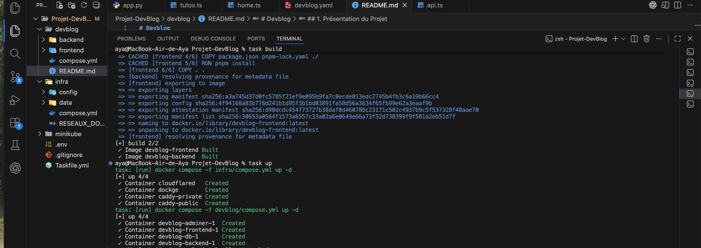

# Devblog

> **⚠️ MEMBRES DU GROUPE :**
>
> - koagne Ngankam Danielle Jamila , Role:Dev
> - MAPENZI IGULU Jacqueline, Role:Infra
> - Aya Sghaier, Role:Dev

---

## 1. Présentation du Projet

_DevBlog est une plateforme web moderne dédiée au partage de connaissances et de tutoriels autour du développement informatique. Le projet repose sur une architecture complète : un frontend réactif (Vite/TypeScript), une API backend (Flask/Python), une base de données PostgreSQL pour la persistance, et un reverse proxy Caddy pour la gestion centralisée des accès. L’ensemble est orchestré via Docker, ce qui garantit portabilité, isolation et simplicité de déploiement._

**Fonctionnalités principales :**

- Création et publication d’articles de blog techniques
- Ajout et partage de tutoriels vidéo (YouTube)
- Consultation rapide des derniers articles et tutos
- Interface utilisateur moderne et responsive
- Administration de la base via Adminer
- Accès sécurisé et centralisé via un reverse proxy (Caddy)
- Déploiement local ou distant facilité grâce à Docker et Cloudflare Tunnel

**Lien accessible (si tunnel actif) :** [https://votre-url-random.trycloudflare.com](https://votre-url-random.trycloudflare.com)

**Screenshot de l'application déployée** : 
[]
[]
[]
[]

## 2. Architecture Technique

### Schéma d'infrastructure

_Ce schéma est généré dynamiquement à partir du fichier `architecture.puml` présent dans ce dépôt._


_(Note aux étudiants : Pour que l'image ci-dessus s'affiche :_

1. _Créez un fichier `architecture.puml` à la racine de votre repo._
2. _Mettez votre code PlantUML dedans._
3. _Remplacez `VOTRE_USERNAME_GITHUB` et `NOM_DU_REPO` dans l'URL ci-dessus par les vôtres._
4. _Assurez-vous que votre repo est Public.)_

### Description des services

| Service    | Image Docker         | Rôle                    | Port Interne |
| :--------- | :------------------- | :---------------------- | :----------- |
| **Proxy**  | `caddy:2.10`         | Reverse Proxy & Routing | 80           |
| **App**    | `devblog  `          | CMS                     | 80           |
| **DB**     | `postgres:15-alpine` | Base de données.        | 5432         |
| **Tunnel** | `cloudflared`        | Exposition Internet     | N/A          |

## 3. Guide d'installation

Nous avons prévu deux façons de lancer le projet. La première avec **Docker Compose** et la version finale sur **Kubernetes**.

### Option A : Lancer avec Docker Compose (Test)

C'est la méthode classique. Il faut juste faire attention à bien lancer l'infra avant l'application.

1. **Lancer la couche infra (Proxy & Tunnel) :**
   ```bash
   cd infra
   docker compose up -d
   ```

2. **Lancer l'application (Site & Base de données) :**
   ```bash
   cd ../devblog
   docker compose up -d
   ```

3. **Vérifier que tout tourne :**
   Pour récupérer l'URL publique générée par le tunnel Cloudflare, on regarde les logs :
   ```bash
   cd ../infra
   docker compose logs -f cloudflared
   ```

   **Aperçu du lancement dans le terminal :**
   []
   []

   Une fois lancé, on peut accéder aux services en local :
   - Site Web : `http://frontend.localhost`
   - Adminer (BDD) : `http://localhost:28080`

   **Screenshots de l'interface :**
   []
   []

---

### Option B : Lancer avec Kubernetes

C'est la version aboutie du projet.

1. **Démarrer le cluster :**
   ```bash
   minikube start --driver=docker
   ```

2. **Charger nos images :**
   *(Étape nécessaire si vous n'avez pas internet pour pull depuis le Docker Hub)*
   ```bash
   minikube image load mjcqln/devblog-frontend:latest
   minikube image load mjcqln/devblog-backend:latest
   ```

3. **Tout déployer :**
   ```bash
   kubectl apply -f minikube/
   ```

4. **Accéder au site :**
   Comme pour Docker, on va chercher l'URL dans les logs du pod Cloudflare :
   ```bash
   kubectl logs -f deployment/cloudflared
   ```
   Il suffit de cliquer sur le lien en `.trycloudflare.com` qui s'affiche.

---

## 4. Méthodologie & Transparence IA

### Organisation

Nous avons travaillé en Pair Programming, avec une répartition des tâches par couche (Front, Back, Infra) et des points de synchronisation réguliers.

### Utilisation de l'IA (Copilot, ChatGPT, Cursor...)

_Soyez honnêtes, c'est valorisé !_

- **Outils utilisés :** Gemini , Chatgpt, Copilot
- **Usage :**
- _Génération de code :_ "Nous avons utilisé Gemini pour générer le code frontend de notre application, afin d’optimiser le temps de développement. "
- _Débuggage :_ "ChatGPT et Copilot nous ont aidé à comprendre les erreurs suivantes:
  - conflits de ports Docker (port 80 déjà utilisé),
  - mauvais routage des requêtes API entraînant des réponses HTML au lieu de JSON
  - erreurs liées à l’ordre des directives dans le Caddyfile
  - problèmes de communication entre conteneurs dus à une mauvaise configuration du réseau Docker
  - limitations de Cloudflare Tunnel (rate limiting)
  - absence de prise en compte des modifications due à l’oubli de reconstruction des images Docker."
- _Documentation :_ ("Nous avons reformulé l'intro avec l'IA")
- **Apprentissage :** (Ce que l'IA a fait vs ce que vous avez compris).


## 5. Difficultés rencontrées & Solutions

- _Problème 1 :_ La base de données ne gardait pas les données.
- _Solution :_ Ajout d'un volume nommé dans le docker-compose.

- _Problème 2 :_ Le tunnel Cloudflare refusait de se connecter via Docker Compose (erreur "Context Canceled"), alors qu'il fonctionnait parfaitement sur Kubernetes.
- _Solution :_ Nous avons compris que par défaut, Cloudflare utilise le protocole **QUIC (basé sur UDP)**, qui est souvent instable dans les environnements locaux/Docker. En forçant l'utilisation du protocole **HTTP/2 (basé sur TCP)** via l'option `--protocol http2` (comme c'était déjà le cas sur notre config Kubernetes), la connexion est devenue stable. Leçon apprise : toujours vérifier le protocole de transport quand un outil réseau échoue "silencieusement".

- _Problème 3 :_ L'application chargeait indéfiniment ou affichait une erreur 502/404, car le Frontend essayait d'appeler l'API sur lui-même au lieu du Backend.
- _Solution :_ Nous avons configuré le proxy de développement de **Vite** ("petit proxy"), via le fichier `vite.config.ts`. Cela permet d'intercepter toutes les requêtes commençant par `/api` et de les rediriger proprement vers le container Backend, résolvant ainsi les erreurs de communication Cross-Container.

