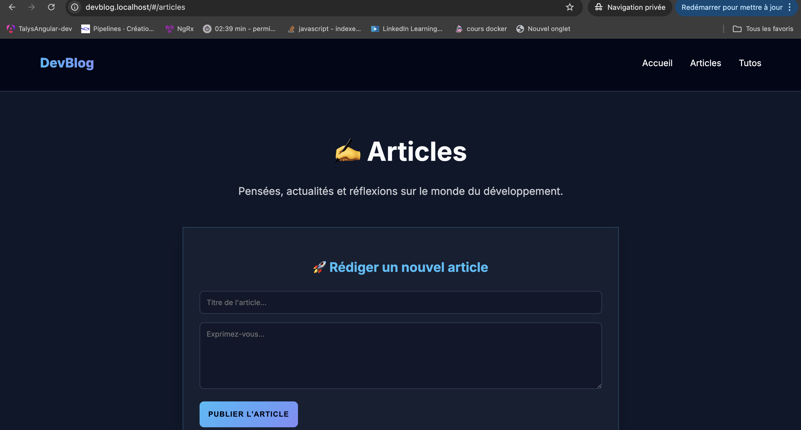
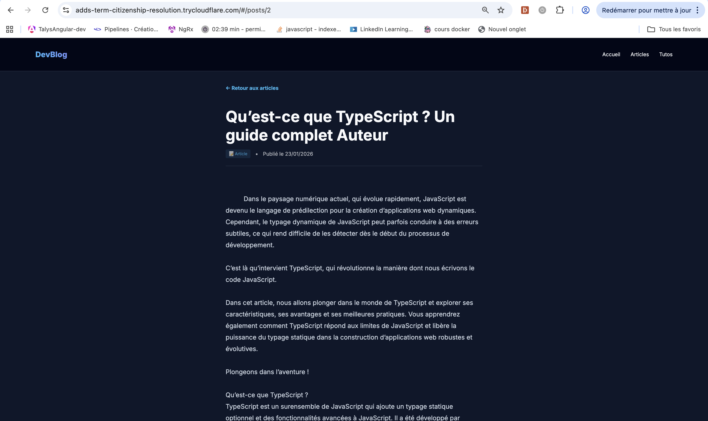
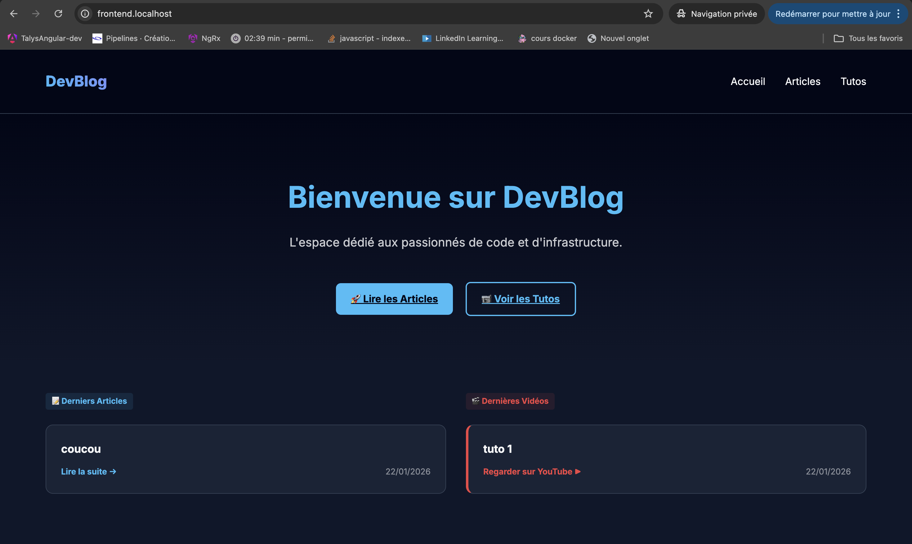
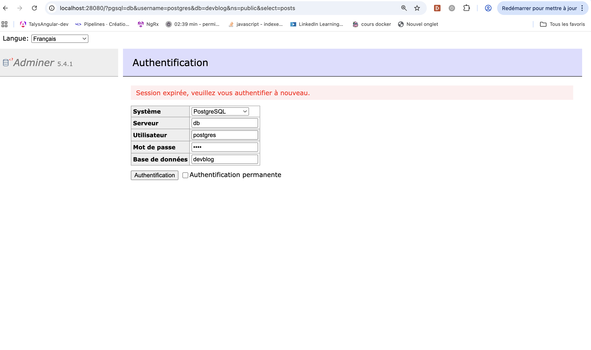

# Devblog

> **⚠️ MEMBRES DU GROUPE :**
>
> - koagne Ngankam Danielle Jamila , Role:Dev backend
> - MAPENZI IGULU Jacqueline, Role:Infra
> - Aya Sghaier, Role:Dev frontend

---

## 1. Présentation du Projet

_DevBlog est une plateforme web moderne dédiée au partage de connaissances et de tutoriels autour du développement informatique. Le projet repose sur une architecture complète : un frontend réactif (Vite/TypeScript), une API backend (Flask/Python), une base de données PostgreSQL pour la persistance, et un reverse proxy Caddy pour la gestion centralisée des accès. L’ensemble est orchestré via Docker, ce qui garantit portabilité, isolation et simplicité de déploiement._

**Fonctionnalités principales :**

- Création et publication d’articles de blog techniques
- Ajout et partage de tutoriels vidéo (YouTube)
- Consultation rapide des derniers articles et tutos
- Interface utilisateur moderne et responsive
- Administration de la base via Adminer
- Accès sécurisé et centralisé via un reverse proxy (Caddy)
- Déploiement local ou distant facilité grâce à Docker et Cloudflare Tunnel

Lien accessible (si tunnel actif) :** [https://approximate-burton-segments-yesterday.trycloudflare.com/](https://approximate-burton-segments-yesterday.trycloudflare.com/) ceci est le dernier lien utilisé

**Lien accessible :** *L'URL est générée dynamiquement au démarrage (voir logs du tunnel).*

**Screenshot de l'application déployée** : 
[]
[]
[]
[]

## 2. Architecture Technique

### Schéma d'infrastructure

_Ce schéma est généré dynamiquement à partir du fichier `architecture.puml` présent dans ce dépôt._


### Description des services

| Service    | Image Docker         | Rôle                    | Port Interne |
| :--------- | :------------------- | :---------------------- | :----------- |
| **Proxy**  | `caddy:2.10`         | Reverse Proxy & Routing | 80           |
| **App**    | `devblog  `          | CMS                     | 80           |
| **DB**     | `postgres:15-alpine` | Base de données.        | 5432         |
| **Tunnel** | `cloudflared`        | Exposition Internet     | N/A          |

## 3. Guide d'installation

### Pré-requis

1. **Récupérer le projet :**
   ```bash
   git clone https://github.com/104MJ/Projet-DevBlog.git
   cd Projet-DevBlog
   ```

2. **Installation de `task` (Optionnel mais recommandé) :**
   On utilise [Task](https://taskfile.dev) pour ne pas avoir à taper des commandes à rallonge.
   *Si vous ne voulez pas l'installer, pas de souci : on a mis les commandes classiques `docker compose` en note dans chaque étape.*

Nous avons prévu deux façons de lancer le projet. La première avec **Docker Compose** et la version finale sur **Kubernetes**.

### Option A : Lancer avec Docker Compose 

1. **Tout lancer d'un coup :**
   ```bash
   task up
   ```
   *Ça va lancer l'infra (Caddy, Tunnel) ET l'appli (Site, BDD) dans le bon ordre.*

   > **Note :** Si vous n'avez pas `task` installé, vous pouvez toujours faire à l'ancienne :
   > `docker compose -f infra/compose.yml up -d` puis `docker compose -f devblog/compose.yml up -d`

2. **Mettre à jour le projet :**
   Vu qu'on a mis en place un **CI/CD**, les images sont construites automatiquement sur GitHub. Pour récupérer la dernière version sans rien casser :
   ```bash
   task pull
   task up
   ```

3. **Tout arrêter proprement :**
   ```bash
   task down
   ```

4. **Accéder au site :**
   Regardez les logs du tunnel pour choper l'URL publique :
   ```bash
   docker compose -f infra/compose.yml logs -f cloudflared
   ```
   Sinon en local : [http://frontend.localhost](http://frontend.localhost) et [http://localhost:28080](http://localhost:28080) (Adminer).

   **Screenshots de l'interface :**
   []
   []

---

### Option B : Lancer avec Kubernetes

C'est la version aboutie du projet.

1. **Démarrer le cluster :**

   ```bash
   minikube start --driver=docker
   ```

2. **Charger nos images :**
   *Plus besoin de le faire à la main !* Grâce au CI/CD, Minikube va télécharger tout seul les images `mjcqln/devblog-backend` et `frontend` depuis le Docker Hub.

3. **Tout déployer :**

   ```bash
   kubectl apply -f minikube/
   ```

4. **Accéder au site :**
   Comme pour Docker, on va chercher l'URL dans les logs du pod Cloudflare :
   ```bash
   kubectl logs -f deployment/cloudflared
   ```
   Il suffit de cliquer sur le lien en `.trycloudflare.com` qui s'affiche.

---

## 4. Méthodologie & Transparence IA

### Organisation

Nous avons travaillé en Pair Programming, avec une répartition des tâches par couche (Front, Back, Infra) et des points de synchronisation réguliers.

### Utilisation de l'IA (Copilot, ChatGPT, Cursor...)

- **Outils utilisés :** Gemini , Chatgpt, Copilot
- **Usage :**
- _Génération de code :_ "Nous avons utilisé Gemini pour générer le code frontend de notre application, afin d’optimiser le temps de développement. "
- _Débuggage :_ "ChatGPT et Copilot nous ont aidé à comprendre les erreurs suivantes:
  - conflits de ports Docker (port 80 déjà utilisé),
  - mauvais routage des requêtes API entraînant des réponses HTML au lieu de JSON
  - erreurs liées à l’ordre des directives dans le Caddyfile
  - problèmes de communication entre conteneurs dus à une mauvaise configuration du réseau Docker
  - limitations de Cloudflare Tunnel (rate limiting)
  - absence de prise en compte des modifications due à l’oubli de reconstruction des images Docker."
- _Documentation :_ ("Nous avons reformulé l'intro avec l'IA")

- **Apprentissage :** (Ce que l'IA a fait vs ce que vous avez compris).
  - * 1 (Réseau)* : Quand le Frontend n'arrivait pas à joindre l'API, Gemini nous a expliqué que `localhost` ne fonctionnait pas **dans** un conteneur. On a ainsi compris qu'il fallait utiliser le nom du service Docker (DNS interne) pour qu'ils communiquent.

  - * 2 (Protocoles)* : Pour le tunnel Cloudflare instable, c'est l'IA qui nous a suggéré de forcer le HTTP2. Cela nous a appris que le protocole par défaut (QUIC/UDP) pouvait bloquer en local.

  - * 3 (Cycle de vie)* : Au début, on changeait le code mais rien ne bougeait sur le site. L'IA nous a rappelé que le conteneur tournait toujours sur l'ancienne image tant qu'on ne faisait pas un `docker build`. Ça nous a forcé à être rigoureux sur les versions (ce qui nous a motivées à mettre en place le CI/CD !).
  => Bref, elle nous a surtout servi à comprendre l'architecture "sous le capot" et à gagner du temps avec le code de l'application.

## 5. Difficultés rencontrées & Solutions

- _Problème 1 :_ La base de données ne gardait pas les données.
- _Solution :_ Ajout d'un volume nommé dans le docker-compose.

- _Problème 2 :_ Le tunnel Cloudflare refusait de se connecter via Docker Compose (erreur "Context Canceled"), alors qu'il fonctionnait parfaitement sur Kubernetes.
- _Solution :_ Nous avons compris que par défaut, Cloudflare utilise le protocole **QUIC (basé sur UDP)**, qui est souvent instable dans les environnements locaux/Docker. En forçant l'utilisation du protocole **HTTP/2 (basé sur TCP)** via l'option `--protocol http2` (comme c'était déjà le cas sur notre config Kubernetes), la connexion est devenue stable. Leçon apprise : toujours vérifier le protocole de transport quand un outil réseau échoue "silencieusement".

- _Problème 3 :_ L'application chargeait indéfiniment ou affichait une erreur 502/404, car le Frontend essayait d'appeler l'API sur lui-même au lieu du Backend.
- _Solution :_ Nous avons configuré le proxy de développement de **Vite** ("petit proxy"), via le fichier `vite.config.ts`. Cela permet d'intercepter toutes les requêtes commençant par `/api` et de les rediriger proprement vers le container Backend, résolvant ainsi les erreurs de communication Cross-Container.
